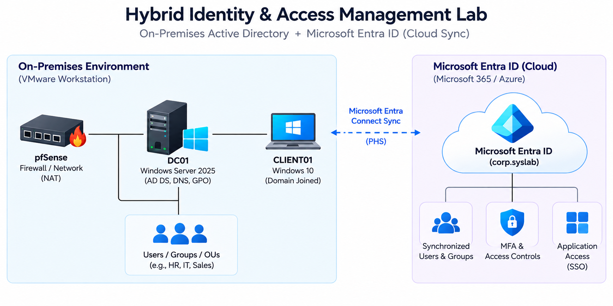

# Hybrid Identity & Access Management Lab

A hands-on Identity and Access Management (IAM) lab integrating **on-premises Active Directory with Microsoft Entra ID** to simulate a hybrid identity environment.

The project focuses on practical IAM operations including identity provisioning, directory synchronization, RBAC, authentication, application access, identity lifecycle management, monitoring, and troubleshooting.

---

## Architecture



The lab consists of an on-premises Windows Server environment connected to Microsoft Entra ID through **Microsoft Entra Cloud Sync**, with pfSense providing supporting network infrastructure.

---

## Objectives

- Build and administer an on-premises Active Directory environment
- Integrate Active Directory with Microsoft Entra ID
- Implement role-based access control (RBAC)
- Configure department-based resource access
- Synchronize identities between AD and Entra ID
- Configure authentication methods and MFA
- Manage Enterprise Application access
- Practice Joiner-Mover-Leaver (JML) workflows
- Monitor provisioning and audit activity
- Troubleshoot identity synchronization issues
- Operate supporting network infrastructure using pfSense

---

## Environment

| Component | Role |
|---|---|
| **Windows Server 2025** | Active Directory Domain Controller |
| **Microsoft Entra ID** | Cloud Identity & Access Management |
| **Windows 10 Client** | Domain-joined endpoint |
| **pfSense** | Network gateway, firewall & DNS |
| **VMware Workstation** | Virtualization platform |

---

## Key Implementations

### Active Directory & RBAC

- Created organizational units for lab users and systems
- Created department-based security groups
- Managed users and group memberships
- Implemented role-based access through security groups
- Configured NTFS permissions for department resources
- Applied Group Policy to domain-joined systems

### Hybrid Identity

- Connected on-premises Active Directory with Microsoft Entra ID
- Configured Microsoft Entra Cloud Sync
- Installed and configured the provisioning agent
- Verified identity synchronization from AD to Entra ID
- Monitored provisioning operations and synchronization status

### Authentication & Access

- Configured Microsoft Entra authentication methods
- Enabled Microsoft Authenticator
- Configured an MFA registration campaign
- Created an Enterprise Application
- Practiced user assignment and application access management

### Identity Lifecycle

Practiced identity lifecycle operations representing:

**Joiner → Mover → Access Update**

User changes made in Active Directory were synchronized to Microsoft Entra ID and verified through provisioning logs.

### Monitoring & Troubleshooting

- Reviewed Microsoft Entra provisioning logs
- Reviewed Entra audit logs
- Verified Create and Update operations
- Investigated provisioning quarantine
- Troubleshot synchronization issues involving the on-premises environment and provisioning agent

### Network Infrastructure

- Deployed pfSense as the lab network gateway and firewall
- Configured DNS and network connectivity through pfSense
- Verified connectivity between Windows Server, Windows Client and Linux Server

---

## IAM Workflow

```text
Active Directory
       │
       │  Identity Changes
       ▼
Microsoft Entra Cloud Sync
       │
       ▼
Microsoft Entra ID
       │
       ├── Authentication / MFA
       │
       ├── Application Access
       │
       └── Audit & Provisioning Logs

```
## Documentation

Detailed implementation steps, screenshots, configurations, and observations are available in the project documentation.

[View Project Documentation](Documentation.pdf)
